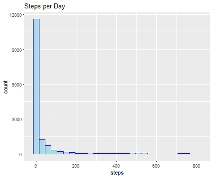
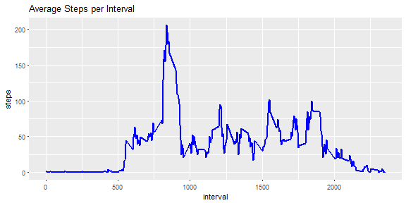
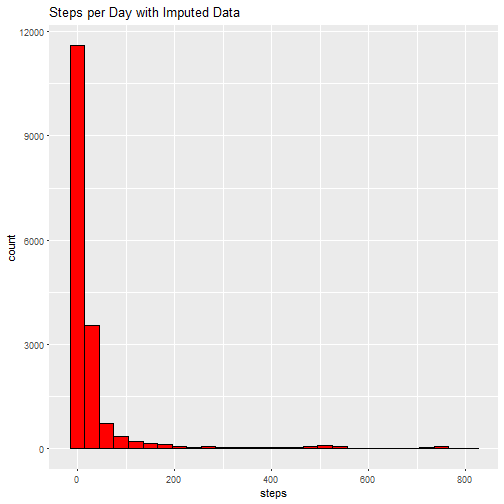
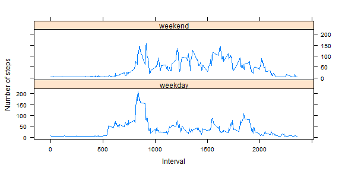

This document will anlayze personal movement activity with data from monitoring devices such as Fitbit, Nike Fuelband, or Jawbone Up. Get the data from  <https://github.com/mhoptum/RepData_PeerAssessment1/activity.zip>.

###Loading and Preprocessing

Load required libraries


```r
library(dplyr)
library(ggplot2)
library(lattice)
library(Hmisc)
```

1. Load the data from your current directory.


```r
dat <- read.csv('./activity.csv')
```

2. What is mean total number of steps taken per day?


```r
ggplot(dat, aes(x=steps)) + geom_histogram(color='blue', fill='lightblue',
                                           binwidth = 30, na.rm = TRUE) +
    labs(title='Steps per Day')
```



```r
mean <- mean(dat$steps, na.rm = TRUE)
median <- median(dat$steps, na.rm = TRUE)
```

Mean steps per day is **37.3825996**.  
Median steps per day is **0**.

###What is the average daily activity pattern?

1. Time series plot


```r
avg_steps.interval <- dat %>%
    na.omit(steps) %>%
    group_by(interval) %>%
    summarise(mean(steps, na.rm=TRUE)) %>%
    setNames(.,c('interval','steps'))

ggplot(avg_steps.interval, aes(x=interval, y=steps)) + geom_line(lwd=1, col='blue') +
    labs(title='Average Steps per Interval')
```



2. Maximum steps in interval

```r
find <- with(avg_steps.interval, which(steps == max(steps)))

max.interval <- avg_steps.interval[find,]$interval
max.steps <- avg_steps.interval[find,]$steps
```
The 5 minute interval with the max number of steps is **835** with **206.1698113** steps.

###Impute missing values

1. Calcuate and impute the total number of missing values


```r
missing <- length(which(is.na(dat$steps)))
```

Missing values: **2304**. 

2. Devise a strategy for filling in all of the missing values in the dataset.
3. Create a new dataset that is equal to the original dataset but with the missing data filled in.


```r
new <- dat
new$steps <- impute(dat$steps, fun=mean)
```


4. What is mean total number of steps taken per day?


```r
ggplot(new, aes(x=steps)) + geom_histogram(color='black', fill='red', 
    binwidth = 30, na.rm = TRUE) +
    labs(title='Steps per Day with Imputed Data')
```

```
## Don't know how to automatically pick scale for object of type impute. Defaulting to continuous.
```



```r
mean <- mean(new$steps, na.rm = TRUE)
median <- median(new$steps, na.rm = TRUE)
```

Mean steps per day is **37.3825996**.  
Median steps per day is **0**.

###Are there differences in activity patterns between weekdays and weekends?

1. New factor variable day.


```r
new$date <- as.Date(new$date)
weekdays <- c('Monday', 'Tuesday', 'Wednesday', 'Thursday', 'Friday')
new$day <- factor((weekdays(new$date) %in% weekdays), 
         levels=c(TRUE, FALSE), labels=c('weekday', 'weekend'))
```

2. Panel plot.


```r
avg_steps.day <- new %>%
    group_by(interval, day) %>%
    summarise(mean(steps, na.rm=TRUE)) %>%
    setNames(.,c('interval', 'day', 'steps'))

xyplot(steps ~ interval | day, data=avg_steps.day, layout=c(1,2), xlab='Interval', ylab='Number of steps', type='l')
```


